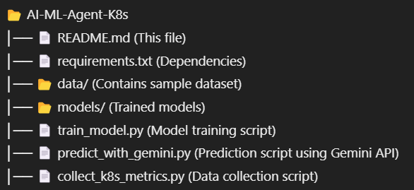

# **AI/ML Model for Predicting Kubernetes Issues 🚀**  

## **Overview**  
Kubernetes clusters can experience failures such as pod crashes, resource bottlenecks, and network issues. This project aims to build an AI/ML model capable of predicting these failures before they occur by analyzing historical and real-time cluster metrics.  

## **Features**  
✔ Predicts **node or pod failures**  
✔ Detects **resource exhaustion (CPU, memory, disk)**  
✔ Identifies **network or connectivity issues**  
✔ Analyzes **service disruptions using logs and events**  
✔ Supports **anomaly detection & time-series analysis**  

## **Project Structure**  


## **Installation & Setup**  

### **1️⃣ Install Dependencies**  
Make sure you have Python **3.10** installed. Then, run:  

```bash
pip install -r requirements.txt
